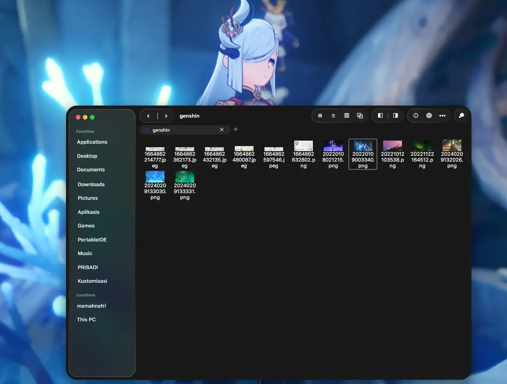
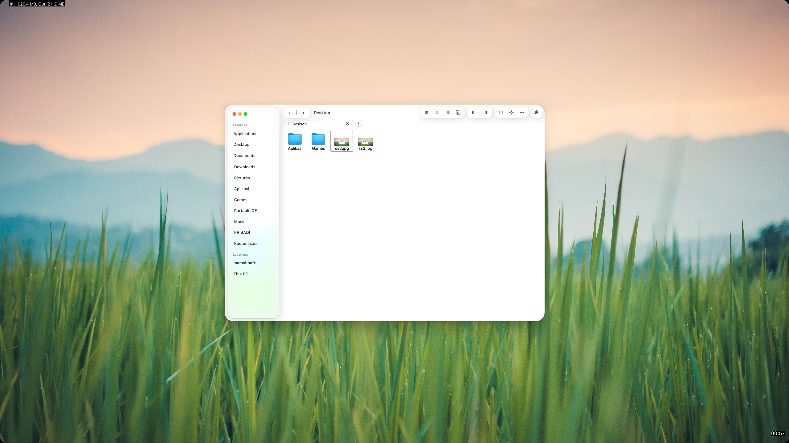

# 🖼️ FindrBordr Native (WPF Explorer Overlay)

Aplikasi WPF C# berbasis Windows yang menempel (*overlay*) secara presisi di atas jendela Windows File Explorer (`CabinetWClass`). 

---

## 📸 Preview & Video Demo

*Klik gambar di atas untuk menonton cuplikan demonstrasi fungsionalitas FindrBordr Native di YouTube.*

---

## 💡 Inspirasi & Kredit Proyek

Proyek ini terinspirasi dari aplikasi kustomisasi antarmuka Windows ternama:
* 🛠️ **[MyDockFinder](https://github.com/mydockfinder/mydockfinder-for-Win10-Win11)**
* 🖼️ **[BorderSkin](https://github.com/mohamedkomalo/BorderSkin)**

---

> [!WARNING]
> **Proyek Eksperimental / Proof of Concept (PoC)**  
> Proyek ini dibangun sepenuhnya menggunakan **AI-assisted / Vibe Coding**. Kode dirancang untuk kebutuhan uji coba fungsionalitas dan kustomisasi personal, sehingga masih memiliki beberapa *bug* dan keterbatasan.  
> 
> 🤝 **Kontribusi Sangat Diharapkan!** Komunitas dan pengembang lain sangat disambut hangat untuk membuka *Issue* maupun *Pull Request (PR)* demi menyempurnakan aplikasi ini agar lebih akurat dan stabil!

---

## ✨ Fitur Utama

- 📌 **Window Docking & Syncing**  
  Menempel dan mengikuti pergerakan File Explorer secara *real-time* menggunakan Win32 `SetWindowPos` dan event hook `SetWinEventHook`.
- 🕹️ **Integrated Navigation Toolbar**  
  Eksekusi kontrol bawaan Explorer (Back, Forward, Up, View, Search, dll.) secara langsung memanfaatkan Win32 `SendKeys`.
- 🌌 **Parallax Wallpaper Effect**  
  Latar belakang jendela menyesuaikan dengan posisi wallpaper desktop Windows untuk memberikan efek transparan yang dinamis.
- 📁 **Custom Shortcuts via Drag & Drop**  
  Tambahkan jalan pintas folder atau file lokal favorit secara instan hanya dengan menyeret (*drag*) file ke area yang disediakan.

---

## 🔒 Izin & Akses Sistem (Win32 APIs)

Aplikasi ini berjalan sebagai aplikasi WPF tingkat lanjut yang melakukan *docking* (menempelkan *overlay* UI) secara dinamis ke jendela **Windows File Explorer** (`CabinetWClass`). 

Aplikasi **tidak memerlukan akses hak administrator (Elevated/Admin privileges)** atau injeksi DLL (*code injection*), namun menggunakan beberapa API bawaan Windows (`user32.dll` & `dwmapi.dll`) untuk memantau serta menyelaraskan posisi *overlay*.

Berikut adalah daftar Win32 API yang digunakan beserta keterangannya secara transparan:

### 1. Pelacakan & Deteksi Jendela Explorer (*Window Tracking & Enumeration*)
Digunakan untuk memantau kapan jendela File Explorer dibuka, ditutup, dipindahkan, atau difokuskan.
* **`SetWinEventHook` & `UnhookWinEvent`**: Memasang *event hook* global (*out-of-context*) untuk mendengarkan perubahan pada sistem Windows tanpa menginjeksi kode ke proses lain.
  * *Event yang dipantau:* Perubahan lokasi (`EVENT_OBJECT_LOCATIONCHANGE`), jendela aktif/fokus (`EVENT_SYSTEM_FOREGROUND`), serta penutupan/pembukaan jendela (`EVENT_OBJECT_DESTROY`, `EVENT_OBJECT_SHOW`, `EVENT_OBJECT_NAMECHANGE`).
* **`EnumWindows`**: Memindai seluruh jendela yang sedang aktif untuk menemukan jendela File Explorer utama jika pelacakan otomatis membutuhkan penyesuaian.
* **`GetForegroundWindow`**: Memeriksa apakah jendela yang sedang difokuskan oleh pengguna adalah File Explorer target.
* **`IsWindow`, `IsWindowVisible`, `GetClassName`, `GetWindowText`**: Memvalidasi status jendela, mengecek apakah kelas jendela adalah `CabinetWClass` (File Explorer), serta mengambil judul *tab/folder* aktif.

### 2. Manipulasi Posisi & Tampilan (*Window Docking & Styling*)
Digunakan untuk menyelaraskan *overlay* UI tepat di atas area File Explorer.
* **`SetWindowPos`**: Mengubah posisi dan ukuran jendela *overlay* agar selalu presisi mengikuti pergerakan File Explorer.
* **`DwmGetWindowAttribute` (`DWMWA_EXTENDED_FRAME_BOUNDS`)**: Mengambil batas bingkai jendela Explorer yang akurat melalui Desktop Window Manager (DWM), termasuk memperhitungkan *drop shadow* transparan.
* **`GetWindowLongPtr` & `SetWindowLongPtr`**:
  * Mengatur *parent/owner* jendela (`GWL_HWNDPARENT`) agar *overlay* melekat pada jendela Explorer.
  * Menambahkan *extended window style* (`WS_EX_NOACTIVATE` & `WS_EX_TOOLWINDOW`) agar jendela *overlay* tidak mengambil fokus ketikan keyboard dari Explorer dan tidak muncul secara terpisah di Alt+Tab / Taskbar.

### 3. Interaksi & Navigasi (*Control & Input Handling*)
Digunakan untuk mengirimkan perintah kontrol navigasi dari tombol *overlay* ke File Explorer.
* **`SetForegroundWindow`**: Mengembalikan fokus input secara instan ke File Explorer saat pengguna mengeklik kontrol *overlay*.
* **`SendMessage`**: Mengirimkan sinyal instruksi standar jendela Windows seperti Tutup (`WM_CLOSE`), Minimize (`SC_MINIMIZE`), dan Maximize/Restore (`SC_MAXIMIZE`/`SC_RESTORE`) langsung ke File Explorer target.
* **`WScript.Shell` (via COM Interop)**: Mengirimkan simulasi *shortcut* keyboard ke File Explorer untuk eksekusi cepat (seperti `Alt+Left` untuk Back, `Ctrl+L` untuk navigasi lokasi, `Ctrl+F` untuk Pencarian, dll.).

### 4. Integrasi Visual Sistem (*System Desktop Integration*)
* **`SystemParametersInfo` (`SPI_GETDESKWALLPAPER`)**: Membaca *path* gambar wallpaper desktop sistem saat ini untuk menghasilkan efek visual *parallax* transparan pada latar belakang *overlay*.

> 💡 **Catatan Privasi & Keamanan:**  
> Aplikasi ini bersifat **100% lokal**. Semua pembacaan jalur folder dan kustomisasi pintasan (*custom shortcuts*) disimpan secara lokal di komputer Anda (`custom_shortcuts.json`) dan tidak ada data yang dikirimkan ke jaringan luar.

---

## 💻 Persyaratan Sistem

| Komponen | Spesifikasi Minimum |
| :--- | :--- |
| **Sistem Operasi** | Windows 10 / Windows 11 |
| **Runtime** | .NET 6.0 SDK / .NET 8.0 SDK |
| **IDE (Opsional)** | Visual Studio 2022 / VS Code |

---

## 🗺️ Roadmap & To-Do

- [ ] 🌙 Memperbaiki opsi **Dark Mode**
- [ ] 🎯 Memperbaiki manajemen fokus jendela File Explorer saat diklik
- [ ] 🧪 Mengimplementasikan efek *refraction* pada bagian sidebar
- [ ] 🔀 Fitur kustomisasi posisi untuk tombol toolbar dan *custom shortcut*

---

## 🤝 Kontribusi

Jalur kontribusi selalu terbuka! Jika Anda memiliki ide perbaikan arsitektur kode, perbaikan *bug*, atau peningkatan visual, silakan kirimkan *Pull Request*.
