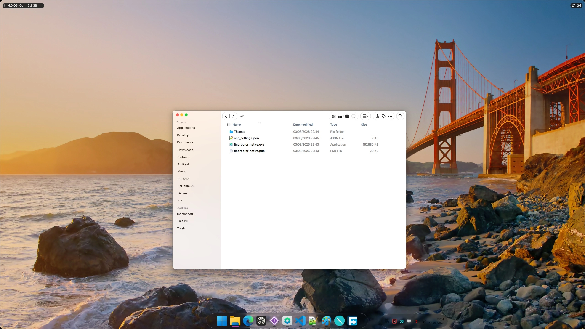
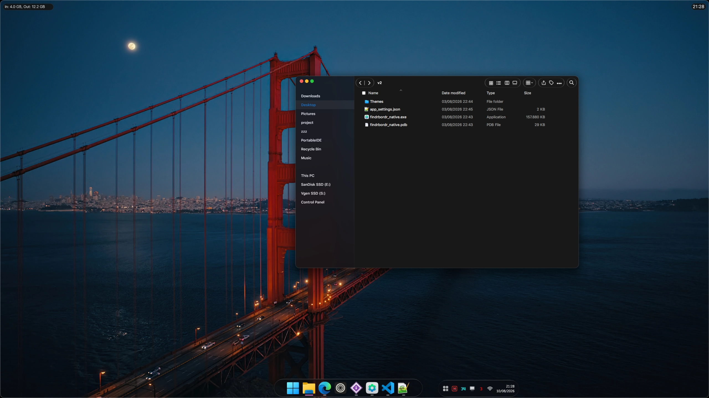
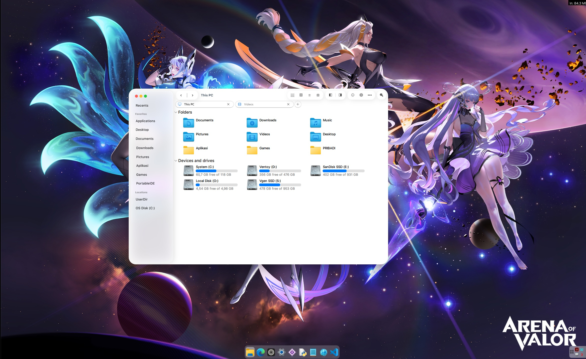

# 🖼️ FindrBordr Native (WPF Explorer Overlay)

A C# WPF application for Windows that seamlessly attaches as a precise overlay on top of the Windows File Explorer window (`CabinetWClass`).

---

## 📸 Preview & Video Demo

*Click the image above to watch a video demonstration of FindrBordr Native on YouTube.*

<table>
  <tr>
    <td align="center">
       
      <b>Gambar 1: os27 Light Theme</b>
    </td>
    <td align="center">
       
      <b>Gambar 2: os27 Dark Theme</b>
    </td>
  </tr>
</table>

<table>
  <tr>
    <td align="center">
       
      <b>Gambar 1: os26 Light Theme</b>
    </td>
    <td align="center">
       
      <b>Gambar 2: os26 Dark Theme</b>
    </td>
  </tr>
</table>

---

## 💡 Inspiration & Credits

This project was inspired by well-known Windows UI customization software:
* 🛠️ **[MyDockFinder](https://github.com/mydockfinder/mydockfinder-for-Win10-Win11)**
* 🖼️ **[BorderSkin](https://github.com/mohamedkomalo/BorderSkin)**

---

> [!WARNING]
> **Experimental Project / Proof of Concept (PoC)**  
> This project was built entirely using **AI-assisted / Vibe Coding**. The codebase was developed for functional testing and personal customization, so it may still contain bugs and limitations.  
> 
> 🤝 **Contributions Are Welcome!** Developers and community members are warmly invited to open *Issues* or submit *Pull Requests (PRs)* to help improve accuracy, performance, and stability!

---

## ✨ Key Features

- 📌 **Window Docking & Syncing**  
  Attaches to and tracks File Explorer movements in real-time using Win32 `SetWindowPos` and global event hooks via `SetWinEventHook`.
- 🕹️ **Integrated Navigation Toolbar**  
  Executes built-in Explorer controls (Back, Forward, Up, View, Search, etc.) directly using Win32 `SendKeys`.
- 🌌 **Parallax Wallpaper Effect**  
  Dynamically aligns its background with the Windows desktop wallpaper to create a seamless depth/parallax transparency effect.
- 📁 **Custom Shortcuts via Drag & Drop**  
  Instantly add shortcuts to your favorite local files or folders by dragging and dropping them into the designated drop zone.

---

## 🔒 System Permissions & Access (Win32 APIs)

This advanced WPF application dynamically docks its overlay UI directly over the **Windows File Explorer** window (`CabinetWClass`). 

It **does not require administrator/elevated privileges** or DLL injection (*code injection*). Instead, it relies on standard Windows Win32 APIs (`user32.dll` & `dwmapi.dll`) to track and align the overlay window smoothly.

Below is a transparent breakdown of the Win32 APIs used in this project:

### 1. Window Tracking & Enumeration
Monitors when File Explorer windows are opened, closed, moved, or focused.
* **`SetWinEventHook` & `UnhookWinEvent`**: Registers global out-of-context event hooks to listen for system-wide window changes without injecting code into external processes.
  * *Monitored Events:* Location changes (`EVENT_OBJECT_LOCATIONCHANGE`), foreground focus changes (`EVENT_SYSTEM_FOREGROUND`), and window creation/destruction (`EVENT_OBJECT_DESTROY`, `EVENT_OBJECT_SHOW`, `EVENT_OBJECT_NAMECHANGE`).
* **`EnumWindows`**: Scans active top-level windows to locate the primary File Explorer target when re-attachment is required.
* **`GetForegroundWindow`**: Checks whether the currently focused window belongs to the target File Explorer process.
* **`IsWindow`, `IsWindowVisible`, `GetClassName`, `GetWindowText`**: Validates window handles, checks for the `CabinetWClass` window class (File Explorer), and retrieves the active tab/folder title.

### 2. Window Docking & Styling
Aligns and styles the overlay UI perfectly over the target File Explorer window.
* **`SetWindowPos`**: Dynamically adjusts the overlay's position and dimensions to match File Explorer in real-time.
* **`DwmGetWindowAttribute` (`DWMWA_EXTENDED_FRAME_BOUNDS`)**: Retrieves accurate window bounds via the Desktop Window Manager (DWM), correctly accounting for transparent drop shadows and borders.
* **`GetWindowLongPtr` & `SetWindowLongPtr`**:
  * Sets window ownership (`GWL_HWNDPARENT`) so the overlay attaches directly to the target Explorer window.
  * Applies extended window styles (`WS_EX_NOACTIVATE` & `WS_EX_TOOLWINDOW`) to prevent the overlay from stealing keyboard focus or appearing separately in Alt+Tab / the Taskbar.

### 3. Navigation & Interaction Handling
Relays user interactions from the overlay buttons back to File Explorer.
* **`SetForegroundWindow`**: Instantly restores focus to File Explorer when an overlay control is clicked.
* **`SendMessage`**: Sends standard Windows commands such as Close (`WM_CLOSE`), Minimize (`SC_MINIMIZE`), and Maximize/Restore (`SC_MAXIMIZE`/`SC_RESTORE`) directly to the target window.
* **`WScript.Shell` (via COM Interop)**: Sends keyboard shortcut commands to File Explorer for quick navigation (e.g., `Alt+Left` for Back, `Ctrl+L` for address bar navigation, `Ctrl+F` for Search, etc.).

### 4. Desktop Visual Integration
* **`SystemParametersInfo` (`SPI_GETDESKWALLPAPER`)**: Reads the active system desktop wallpaper path to generate a dynamic parallax background effect behind the overlay.

> 💡 **Privacy & Security Notice:**  
> This application works **100% locally**. All folder paths and custom shortcut configurations are saved locally on your computer in `app_settings.json`. No data is ever collected or sent over the network.

---

## 💻 System Requirements

| Component | Minimum Requirement |
| :--- | :--- |
| **Operating System** | Windows 10 / Windows 11 (64-bit / x64) |
| **Runtime** | [.NET 8.0 Desktop Runtime (x64)](https://dotnet.microsoft.com/en-us/download/dotnet/8.0) *(Not required for Standalone Release)* |
| **Development** | .NET 8.0 SDK / Visual Studio 2022 / VS Code |

---

## 🗺️ Roadmap & To-Do

- [ ] 🌙 Improve **Dark Mode** support and theme toggling
- [ ] 🎯 Refine window focus management when interacting with overlay elements
- [ ] 🧪 Implement a sidebar refraction/blur effect
- [ ] 🔀 Add customization options for reordering toolbar buttons and custom shortcuts

---

## 🤝 Contributing

Contributions are always welcome! If you have suggestions for architectural improvements, bug fixes, or visual enhancements, feel free to open an issue or submit a Pull Request.
